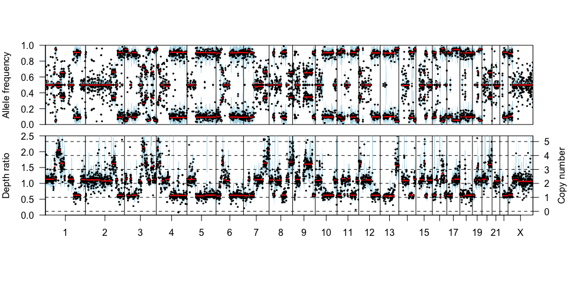

Sequenza: Copy Number Estimation from Tumor Genome Sequencing Data
==================================================================

[](https://cran.r-project.org/package=sequenza) [](https://cran.r-project.org/package=sequenza) [](https://www.gnu.org/licenses/gpl-3.0.txt)


About
-----

Sequenza is a tool to analyze genomic sequencing data from paired normal-tumor samples, including cellularity and ploidy estimation; mutation and copy number (allele-specific and total copy number) detection, quantification and visualization.

Introduction
------------

Deep sequence of tumor DNA along with corresponding normal DNA can provide a valuable perspective on the mutations and aberrations that characterize the tumor. However, analysis of this data can be impeded by tumor cellularity and heterogeneity and by unwieldy data. Here we describe *Sequenza*, an R package that enables the efficient estimation of tumor cellularity and ploidy, and generation of copy number, loss-of-heterozygosity, and mutation frequency profiles.

This document details a typical analysis of matched tumor-normal exome sequence data using *sequenza*.

Getting started
---------------

### Minimum requirements

-   Software: R, Python, SAMtools, tabix
-   Operating system: Linux, OS X, Windows
-   Memory: Minimum 4 GB of RAM. Recommended &gt;8 GB.
-   Disk space: 1.5 GB for sample (depending on sequencing depth)
-   R version: 3.2.0
-   Python version: 2.7, 3.4, 3.5, 3.6 (or PyPy)

### Installation

The R package can be installed by:

``` r
setRepositories(graphics = FALSE, ind = 1:6)
install.packages("sequenza")
```

To install the Python companion package *sequenza-utils* to preprocess BAM files, refer to the [*sequenza-utils*](https://pypi.org/project/sequenza-utils) project page, or simply use the python package manager from the command prompt:

``` bash
pip install sequenza-utils
```

Running sequenza
----------------

### Preprocessing of input files

In order to obtain precise mutational and aberration patterns in a tumor sample, Sequenza requires a matched normal sample from the same patient. Typically, the following files are needed to get started with Sequenza:

-   A BAM file (or a derived pileup file) from the tumor specimen.
-   A BAM file (or a derived pileup file) from the normal specimen.
-   A FASTA reference genomic sequence file

The normal and tumor BAM files are processed together to generate a *seqz* file, which is the required input for the analysis. It is possible to generate a *seqz* starting from other processed data, such as pileup, or from the results from other analyses. The available options are described in the [*sequenza-utils*](http://sequenza-utils.readthedocs.io/) manual pages.

The *sequenza-utils* command provides various tools; here we highlight only the basic usage:

-   Process a FASTA file to produce a GC [Wiggle](https://genome.ucsc.edu/goldenpath/help/wiggle.html) track file:

``` bash
sequenza−utils gc_wiggle −w 50 --fasta hg19.fa -o hg19.gc50Base.wig.gz
```

-   Process BAM and Wiggle files to produce a *seqz* file:

``` bash
sequenza−utils bam2seqz -n normal.bam -t tumor.bam --fasta hg19.fa \
    -gc hg19.gc50Base.wig.gz -o out.seqz.gz
```

-   Post-process by binning the original *seqz* file:

``` bash
sequenza−utils seqz_binning --seqz out.seqz.gz -w 50 -o out small.seqz.gz
```

### Sequenza analysis (in R)

``` r
library(sequenza)
```

In the package is provided a small *seqz* file

``` r
data.file <-  system.file("data", "example.seqz.txt.gz", package = "sequenza")
data.file
```

    ## [1] "/usr/local/lib/R/3.4/site-library/sequenza/data/example.seqz.txt.gz"

The main interface consists of 3 functions:

-   sequenza.extract: process seqz data, normalization and segmentation

``` r
test <- sequenza.extract(data.file, verbose = FALSE)
```

-   sequenza.fit: run grid-search approach to estimate cellularity and ploidy

``` r
CP <- sequenza.fit(test)
```

-   sequenza.results: write files and plots using suggested or selected solution

``` r
sequenza.results(sequenza.extract = test,
    cp.table = CP, sample.id = "Test",
    out.dir="TEST")
```

Plots and Results
-----------------

The function *sequenza.results* outputs various files in the specified path. The result files are either output in pdf of in plain text file, and comprise quality control assessments (eg evaluate GC-correction), visualization of the data and results files, such as segmentation and mutation lists

### Result files

Each generated file is briefly explained in the following table

| Files                            | Description                                                                                                                                                                                |
|:---------------------------------|:-------------------------------------------------------------------------------------------------------------------------------------------------------------------------------------------|
| Test\_alternative\_fit.pdf       | Alternative solution fir to the segments. One solution per slide                                                                                                                           |
| Test\_alternative\_solutions.txt | List of all ploidy/cellularity alternative solution                                                                                                                                        |
| Test\_chromosome\_depths.pdf     | Visualization of sequencing coverage in the normal and in the tumor samples, before and after normalization                                                                                |
| Test\_chromosome\_view.pdf       | Visualization per chromosome of depth.ratio, B-allele frequency and mutations, using the selected or estimated solution. One chromosome per slide                                          |
| Test\_CN\_bars.pdf               | Bar plot representing the percentage of genome in the detected copy number states                                                                                                          |
| Test\_confints\_CP.txt           | Table of the confidence inerval of the best solution from the model                                                                                                                        |
| Test\_CP\_contours.pdf           | Visualization of the likelihood density for each pair of cellularity/ploidy solution. The local maximum-likelihood points and confidence interval of the best estimate are also visualized |
| Test\_gc\_plots.pdf              | Visualization of the GC correction in the normal and in the tumor sample                                                                                                                   |
| Test\_genome\_view.pdf           | Genome-whide visualization of the allele-specific and absolute copy number results, and raw profile of the depth ratio and allele frequency                                                |
| Test\_model\_fit.pdf             | model\_fit.pdf                                                                                                                                                                             |
| Test\_mutations.txt              | Table with mutation and estimated number of mutated alleles (Mt)                                                                                                                           |
| Test\_segments.txt               | Table listing the detected segments, with estimated copy number state at each sement                                                                                                       |
| Test\_sequenza\_cp\_table.RData  | RData object dump of the maxima a posteriori computation                                                                                                                                   |
| Test\_sequenza\_extract.RData    | RData object dump of all the sample information                                                                                                                                            |
| Test\_sequenza\_log.txt          | Log with version and time information                                                                                                                                                      |

### Segments results

One of the most useful output of the anaylsis is the segmentation file. Few lines of the test sample are listed in the table below:

| chromosome |  start.pos|    end.pos|     Bf|  N.BAF|  sd.BAF|  depth.ratio|  N.ratio|  sd.ratio|  CNt|    A|    B|     LPP|
|:-----------|----------:|----------:|------:|------:|-------:|------------:|--------:|---------:|----:|----:|----:|-------:|
| 1          |     881992|   54694219|  0.499|   1636|   0.092|        1.130|     2172|     0.557|    2|    1|    1|  -7.988|
| 1          |   54700724|   60223464|  0.345|     73|   0.080|        1.530|      101|     1.482|    3|    2|    1|  -6.739|
| 1          |   60381518|   67890614|  0.047|     94|   0.034|        1.155|      114|     0.492|    2|    2|    0|  -7.187|
| 1          |   68151686|   92262955|  0.478|    264|   0.072|        2.052|      338|     1.626|    4|    2|    2|  -6.831|
| 1          |   92445264|  118165373|  0.344|    315|   0.083|        1.631|      434|     1.021|    3|    2|    1|  -6.955|
| 1          |  118165645|  121485317|  0.495|     62|   0.088|        1.167|       85|     0.489|    2|    1|    1|  -6.928|

The columns represents:

1.  **chromosome**: Chromosome
2.  **start.pos**: Start position of the segment
3.  **end.pos**: End position of the segment
4.  **Bf**: B-allele frequency value
5.  **N.BAF**: Number of observation to compute *Bf* in the segment
6.  **sd.BAF**: Standard deviation of *Bf*
7.  **depth.ratio**: Adjusted and normalized depth ratio tumor / normal
8.  **N.ratio**: Number of observation to compute *depth.ratio* in the segment
9.  **sd.ratio**: Standard deviation of *depth.rati*
10. **CNt**: Estimated total copy number value
11. **A**: Estimated number of A-alleles
12. **B**: Estimated number of B-alleles (minor allele)
13. **LPP**: Log-posterior probability of the segment

### Gene wide overview

#### Allele-specific copy number


#### Total copy number


#### Raw profile



### Grid search maximum likelihood

``` r
cp.plot(CP)
cp.plot.contours(CP, add = TRUE,
   likThresh = c(0.999, 0.95),
   col = c("lightsalmon", "red"), pch = 20)
```


### Chromosome view

Maybe one of the most useful visualization is the *chromosome view*. This visualization ease the ispection of the segmentation results, compared to binned profile of the raw data. In addition provide visualization of the mutation frequency, that can help to corroborate the selected model.

``` r
chromosome.view(mut.tab = test$mutations[[1]], baf.windows = test$BAF[[1]],
                ratio.windows = test$ratio[[1]],  min.N.ratio = 1,
                segments = seg.tab[seg.tab$chromosome == test$chromosomes[1],],
                main = test$chromosomes[1],
                cellularity = 0.89, ploidy = 1.9,
                avg.depth.ratio = 1)
```


